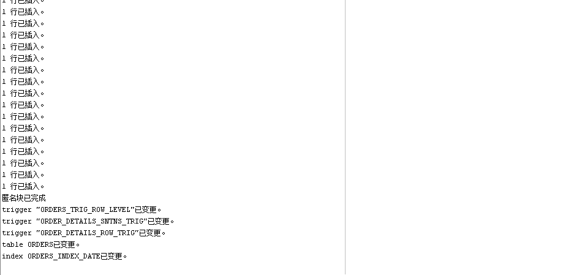
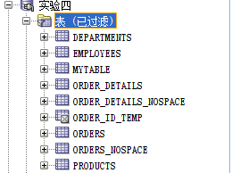
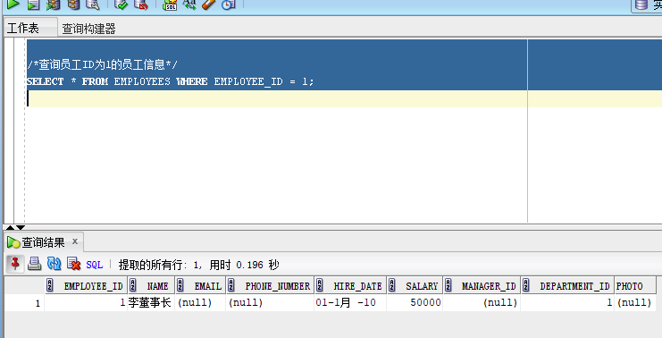
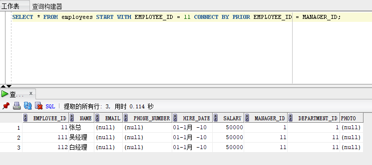
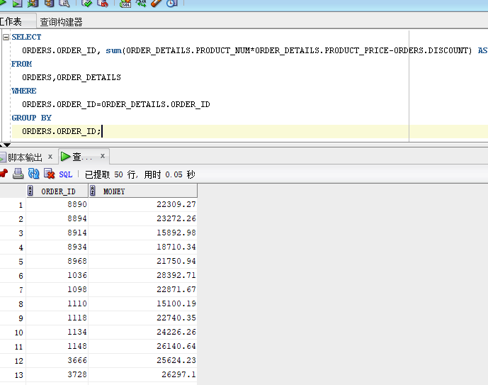
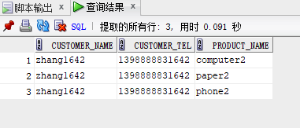
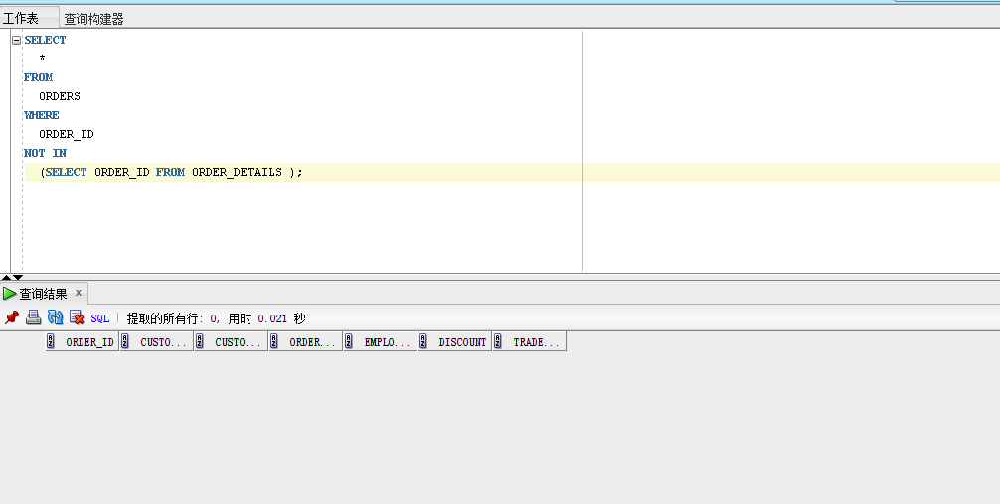
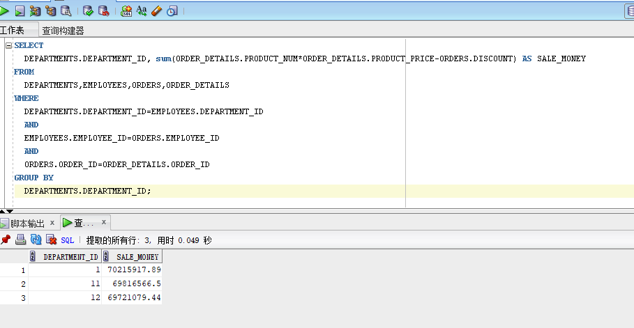
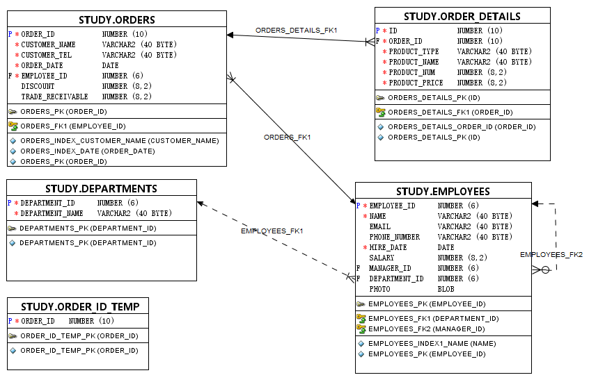

# 实验4：对象管理 

## 实验目的：

了解Oracle表和视图的概念，学习使用SQL语句Create Table创建表，学习Select语句插入，修改，删除以及查询数据，学习使用SQL语句创建视图，学习部分存储过程和触发器的使用。


## 实验场景：

假设有一个生产某个产品的单位，单位接受网上订单进行产品的销售。通过实验模拟这个单位的部分信息：员工表，部门表，订单表，订单详单表。


## 实验内容：

### 录入数据：

要求至少有1万个订单，每个订单至少有4个详单。至少有两个部门，每个部门至少有1个员工，其中只有一个人没有领导，一个领导至少有一个下属，并且它的下属是另一个人的领导（比如A领导B，B领导C）。





### 序列的应用

插入ORDERS和ORDER_DETAILS 两个表的数据时，主键ORDERS.ORDER_ID, ORDER_DETAILS.ID的值必须通过序列SEQ_ORDER_ID和SEQ_ORDER_ID取得，不能手工输入一个数字。

### 触发器的应用：

维护ORDER_DETAILS的数据时（insert,delete,update）要同步更新ORDERS表订单应收货款ORDERS.Trade_Receivable的值。

```mssql
--创建3个触发器
--------------------------------------------------------
--  DDL for Trigger ORDERS_TRIG_ROW_LEVEL
--------------------------------------------------------
CREATE OR REPLACE EDITIONABLE TRIGGER "ORDERS_TRIG_ROW_LEVEL"
BEFORE INSERT OR UPDATE OF DISCOUNT ON "ORDERS"
FOR EACH ROW --行级触发器
declare
  m number(8,2);
BEGIN
  if inserting then
       :new.TRADE_RECEIVABLE := - :new.discount;
  else
      select sum(PRODUCT_NUM*PRODUCT_PRICE) into m from ORDER_DETAILS where ORDER_ID=:old.ORDER_ID;
      if m is null then
        m:=0;
      end if;
      :new.TRADE_RECEIVABLE := m - :new.discount;
  end if;
END;

--批量插入订单数据之前，禁用触发器
ALTER TRIGGER "ORDERS_TRIG_ROW_LEVEL" DISABLE;


--------------------------------------------------------
--  DDL for Trigger ORDER_DETAILS_ROW_TRIG
--------------------------------------------------------

CREATE OR REPLACE EDITIONABLE TRIGGER "ORDER_DETAILS_ROW_TRIG"
AFTER DELETE OR INSERT OR UPDATE  ON ORDER_DETAILS
FOR EACH ROW
BEGIN
  --DBMS_OUTPUT.PUT_LINE(:NEW.ORDER_ID);
  IF :NEW.ORDER_ID IS NOT NULL THEN
    MERGE INTO ORDER_ID_TEMP A
    USING (SELECT 1 FROM DUAL) B
    ON (A.ORDER_ID=:NEW.ORDER_ID)
    WHEN NOT MATCHED THEN
      INSERT (ORDER_ID) VALUES(:NEW.ORDER_ID);
  END IF;
  IF :OLD.ORDER_ID IS NOT NULL THEN
    MERGE INTO ORDER_ID_TEMP A
    USING (SELECT 1 FROM DUAL) B
    ON (A.ORDER_ID=:OLD.ORDER_ID)
    WHEN NOT MATCHED THEN
      INSERT (ORDER_ID) VALUES(:OLD.ORDER_ID);
  END IF;
END;

ALTER TRIGGER "ORDER_DETAILS_ROW_TRIG" DISABLE;
--------------------------------------------------------
--  DDL for Trigger ORDER_DETAILS_SNTNS_TRIG
--------------------------------------------------------

  CREATE OR REPLACE EDITIONABLE TRIGGER "ORDER_DETAILS_SNTNS_TRIG"
AFTER DELETE OR INSERT OR UPDATE ON ORDER_DETAILS
declare
  m number(8,2);
BEGIN
  FOR R IN (SELECT ORDER_ID FROM ORDER_ID_TEMP)
  LOOP
    --DBMS_OUTPUT.PUT_LINE(R.ORDER_ID);
    select sum(PRODUCT_NUM*PRODUCT_PRICE) into m from ORDER_DETAILS
      where ORDER_ID=R.ORDER_ID;
    if m is null then
      m:=0;
    end if;
    UPDATE ORDERS SET TRADE_RECEIVABLE = m - discount
      WHERE ORDER_ID=R.ORDER_ID;
  END LOOP;
  --delete from ORDER_ID_TEMP; --这句话很重要，否则可能一直不释放空间，后继插入会非常慢。
END;
```


### 查询数据：

1.查询某个员工的信息

```sql

/*查询员工ID为1的员工信息*/
SELECT * FROM EMPLOYEES WHERE EMPLOYEE_ID = 1;

```



2.递归查询某个员工及其所有下属，子下属员工。

```sql
SELECT * FROM employees START WITH EMPLOYEE_ID = 11 CONNECT BY PRIOR EMPLOYEE_ID = MANAGER_ID;
```



3.查询订单表，并且包括订单的订单应收货款: Trade_Receivable= sum(订单详单表.ProductNum*订单详单表.ProductPrice)- Discount。

```sql
SELECT
	ORDERS.ORDER_ID, sum(ORDER_DETAILS.PRODUCT_NUM*ORDER_DETAILS.PRODUCT_PRICE-ORDERS.DISCOUNT) AS Money
FROM
	ORDERS,ORDER_DETAILS
WHERE 
	ORDERS.ORDER_ID=ORDER_DETAILS.ORDER_ID
GROUP BY
	ORDERS.ORDER_ID;

```




4.查询订单详表，要求显示订单的客户名称和客户电话，产品类型用汉字描述。

```sql
SELECT
	CUSTOMER_NAME,CUSTOMER_TEL,PRODUCTS.PRODUCT_NAME
FROM
	ORDERS,ORDER_DETAILS,PRODUCTS
WHERE 
	ORDERS.ORDER_ID=ORDER_DETAILS.ORDER_ID 
	AND
	ORDER_DETAILS.PRODUCT_NAME=PRODUCTS.PRODUCT_NAME
	AND
	CUSTOMER_NAME='zhang1642';
```




5.查询出所有空订单，即没有订单详单的订单。

```sql
SELECT
	*  
FROM 
	ORDERS
WHERE 
	ORDER_ID 
NOT IN 
	(SELECT ORDER_ID FROM ORDER_DETAILS );
```



6.查询部门表，同时显示部门的负责人姓名。

```sql
SELECT
	DEPARTMENT_NAME,EMPLOYEES.NAME 
FROM
	DEPARTMENTS,EMPLOYEES
WHERE
	DEPARTMENTS.DEPARTMENT_ID=EMPLOYEES.DEPARTMENT_ID
	AND
	DEPARTMENT_NAME='销售部1';


```


7.查询部门表，统计每个部门的销售总金额。

```sql
SELECT
	DEPARTMENTS.DEPARTMENT_ID, sum(ORDER_DETAILS.PRODUCT_NUM*ORDER_DETAILS.PRODUCT_PRICE-ORDERS.DISCOUNT) AS SALE_MONEY
FROM
	DEPARTMENTS,EMPLOYEES,ORDERS,ORDER_DETAILS
WHERE
	DEPARTMENTS.DEPARTMENT_ID=EMPLOYEES.DEPARTMENT_ID
	AND
	EMPLOYEES.EMPLOYEE_ID=ORDERS.EMPLOYEE_ID
	AND
	ORDERS.ORDER_ID=ORDER_DETAILS.ORDER_ID 
GROUP BY
	DEPARTMENTS.DEPARTMENT_ID;	
```



## 表结构

- 部门表DEPARTMENTS,表空间：USERS

| 编号 | 字段名          | 数据类型          | 可以为空 | 注释           |
| ---- | --------------- | ----------------- | -------- | -------------- |
| 1    | DEPARTMENT_ID   | NUMBER(6,0)       | NO       | 部门ID，主键   |
| 2    | DEPARTMENT_NAME | VARCHAR2(40 BYTE) | NO       | 部门名称，非空 |

- 产品表PRODUCTS,表空间：USERS

| 编号 | 字段名       | 数据类型          | 可以为空 | 注释                               |
| ---- | ------------ | ----------------- | -------- | ---------------------------------- |
| 1    | PRODUCT_NAME | VARCHAR2(40 BYTE) | NO       | 产品名称，产品表的主键             |
| 2    | PRODUCT_TYPE | VARCHAR2(40 BYTE) | NO       | 产品类型，只能取值：耗材,手机,电脑 |

- 员工表EMPLOYEES,表空间：USERS

| 编号 | 字段名        | 数据类型          | 可以为空 | 注释                                                         |
| ---- | ------------- | ----------------- | -------- | ------------------------------------------------------------ |
| 1    | EMPLOYEE_ID   | NUMBER(6,0)       | NO       | 员工ID，员工表的主键。                                       |
| 2    | NAME          | VARCHAR2(40 BYTE) | NO       | 员工姓名，不能为空，创建不唯一B树索引。                      |
| 3    | EMAIL         | VARCHAR2(40 BYTE) | YES      | 电子信箱                                                     |
| 4    | PHONE_NUMBER  | VARCHAR2(40 BYTE) | YES      | 电话                                                         |
| 5    | HIRE_DATE     | DATE              | NO       | 雇佣日期                                                     |
| 6    | SALARY        | NUMBER(8,2)       | YES      | 月薪，必须>0                                                 |
| 7    | MANAGER_ID    | NUMBER(6,0)       | YES      | 员工的上司，是员工表EMPOLYEE_ID的外键，MANAGER_ID不能等于EMPLOYEE_ID,即员工的领导不能是自己。主键删除时MANAGER_ID设置为空值。 |
| 8    | DEPARTMENT_ID | NUMBER(6,0)       | YES      | 员工所在部门，是部门表DEPARTMENTS的外键                      |
| 9    | PHOTO         | BLOB              | YES      | 员工照片                                                     |

- 订单表ORDERS, 表空间：分区表：USERS,USERS02

| 编号 | 字段名           | 数据类型          | 可以为空 | 注释                                                         |
| ---- | ---------------- | ----------------- | -------- | ------------------------------------------------------------ |
| 1    | ORDER_ID         | NUMBER(10,0)      | NO       | 订单编号，主键，值来自于序列：SEQ_ORDER_ID                   |
| 2    | CUSTOMER_NAME    | VARCHAR2(40 BYTE) | NO       | 客户名称，B树索引                                            |
| 3    | CUSTOMER_TEL     | VARCHAR2(40 BYTE) | NO       | 客户电话                                                     |
| 4    | ORDER_DATE       | DATE              | NO       | 订单日期，根据该属性分区存储：2015年及以前的数据存储在USERS表空间，2016年及以后的数据存储在USERS02表空间中。 |
| 5    | EMPLOYEE_ID      | NUMBER(6,0)       | NO       | 订单经手人，员工表EMPLOYEES的外键                            |
| 6    | DISCOUNT         | Number(8,2)       | YES      | 订单整体优惠金额。默认值为0                                  |
| 7    | TRADE_RECEIVABLE | Number(8,2)       | YES      | 订单应收货款，默认为0，Trade_Receivable= sum(订单详单表.Product_Num*订单详单表.Product_Price)- Discount |

- 订单详单表ORDER_DETAILS, 表空间：分区表：USERS,USERS02，分区参照ORDERS表。

| 编号 | 字段名        | 数据类型          | 可以为空 | 注释                                           |
| ---- | ------------- | ----------------- | -------- | ---------------------------------------------- |
| 1    | ID            | NUMBER(10,0)      | NO       | 本表的主键，值来自于序列：SEQ_ORDER_DETAILS_ID |
| 2    | ORDER_ID      | NUMBER(10,0)      | NO       | 所属的订单号，订单表ORDERS的外键               |
| 4    | PRODUCT_NAME  | VARCHAR2(40 BYTE) | NO       | 产品名称, 是产品表PRODUCTS的外键               |
| 5    | PRODUCT_NUM   | NUMBER(8,2)       | NO       | 产品销售数量，必须>0                           |
| 6    | PRODUCT_PRICE | NUMBER(8,2)       | NO       | 产品销售价格                                   |

- 数据关系图如下 

## 总结

通过本次实验进行了视图的操作，了解Oracle表和视图的概念，学习使用SQL语句Create Table创建表，学习Select语句插入，修改，删除以及查询数据，学习使用SQL语句创建视图，学习了部分存储过程和触发器的使用。对Oracle的理论知识进行实践化，更加理解了Oracle的设计原理和功能。
