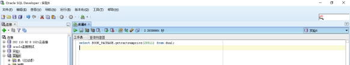
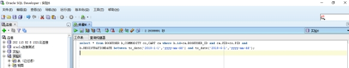

#### 姓名：曾河霖

#### 学号：201810414206

#### 班级：18软工班

#### 用户名：system
# 实验6（期末考核） 基于Oracle的书籍交易系统数据库设计

#### 1.创建表空间

· space_qhl001

 

 

 

#### 2. 创建角色及用户

 用户默认使用表空间space_qhl001  
 创建第一个角色和用户  

· 创建角色qhl1将connect,resource,create view授权给qhl1

· 创建用户qhl_1

· 分配60M空间给qhl_1并将角色qhl1授权给用户qhl_1

 

 

 

 创建第二个角色和用户  

· 创建角色qhl2，将connect,resource权限给qhl2

· 创建用户qhl_2

· 分配60M空间给qhl_2并将角色qhl2授权给用户qhl_2

 

 

####  3. 在用户qhl_1下创建表  

 创建管理员表  

· id为主键

 

 创建用户表  

· id为主键

· 根据注册日期按范围分区

· 分为2018和2019年两个分区，每年按季度划4个子分区

 

 创建商品表  

 

 创建购物车表  

· 用户表字段BOOKUSER_ID为购物车表的外键

· 购物车采用引用分区

 

 论坛表  

 

 

 创建完成后表结构如下  

 创建视图计算每个用户购车中单个商品的总价  

 

 

 

####  6.创建程序包、存储过程、函数执行分析计划  

 创建程序包  

· 函数getcartsumprice计算每个用户的购物车商品总金额

· 存储过程adduser插入用户信息

 

 创建函数、存储过程  

 

 

 存储过程、函数执行分析  

使用自定义函数getcartsumprice（）查询id号为20011的用户购物车商品总价

 

 

使用存储过程adduser插入用户数据

 

 

 

 

 

 执行计划分析  

 

 

 表空间使用状况  

 

 

####  7.备份恢复  

· 备份./rman_level0.sh

 

· 查看备份内容

 

 

 

· 删除数据

 

· 恢复备份

 

数据已恢复

 

#### 8.容灾

· 主库查询确认组数

 

· 主库增加standbylogfile：

 

· 主库环境开启强制归档并修改参数

 

 

 

· 在备库oracle用户创建归档目录，数据目录并设置权限

 

 

· 备库下执行

 

 

· 修改主库及备库下文件
/home/oracle/app/oracle/product/12.1.0/dbhome_1/network/admin/tnsnames.ora
加入配置：

ORCL =

 (DESCRIPTION =

  (ADDRESS_LIST =

   (ADDRESS = (PROTOCOL = TCP)(HOST = 192.168.1.104)(PORT = 1521))  //**

  )

  (CONNECT_DATA =

   (SERVER = DEDICATED)

   (SERVICE_NAME = orcl)

  )

 )

 

stdorcl =

 (DESCRIPTION =

  (ADDRESS = (PROTOCOL = TCP)(HOST = 192.168.1.103)(PORT = 1521))  //**

  (CONNECT_DATA =

   (SERVER = DEDICATED)

   (SID = orcl)

  )

 )	

· 在主库上生成备库的参数文件

create pfile from spfile;

 

· 将主库的参数文件，密码文件拷贝到备库

 

scp /home/oracle/app/oracle/product/12.1.0/dbhome_1/dbs/initorcl.ora 192.168.1.103:/home/oracle/app/oracle/product/12.1.0/dbhome_1/dbs/

scp /home/oracle/app/oracle/product/12.1.0/dbhome_1/dbs/orapworcl 192.168.1.103:/home/oracle/app/oracle/product/12.1.0/dbhome_1/dbs/

 

 

· 在备库增加静态监听

gedit /home/oracle/app/oracle/product/12.1.0/dbhome_1/network/admin/listener.ora

 

SID_LIST_LISTENER =

 (SID_LIST =

  (SID_DESC =

   (ORACLE_HOME = /home/oracle/app/oracle/product/12.1.0/db_1)

   (SID_NAME = orcl)

  )

 )

· 将主库复制到备库

rman target sys/123@orcl auxiliary sys/123@stdorcl

 

run{ 

allocate channel c1 type disk;

allocate channel c2 type disk;

allocate channel c3 type disk;

allocate AUXILIARY channel c4 type disk;

allocate AUXILIARY channel c5 type disk;

allocate AUXILIARY channel c6 type disk;

DUPLICATE TARGET DATABASE

 FOR STANDBY

 FROM ACTIVE DATABASE

 DORECOVER

 NOFILENAMECHECK;

release channel c1;

release channel c2;

release channel c3;

release channel c4;

release channel c5;

release channel c6;

}

输出结果

#### 9.总结

通过此次期末项目的实践，对于oracle数据库的使用变得更加熟练，对于它的原理也更加清楚。为今后涉及到oracle项目开发奠定基础。